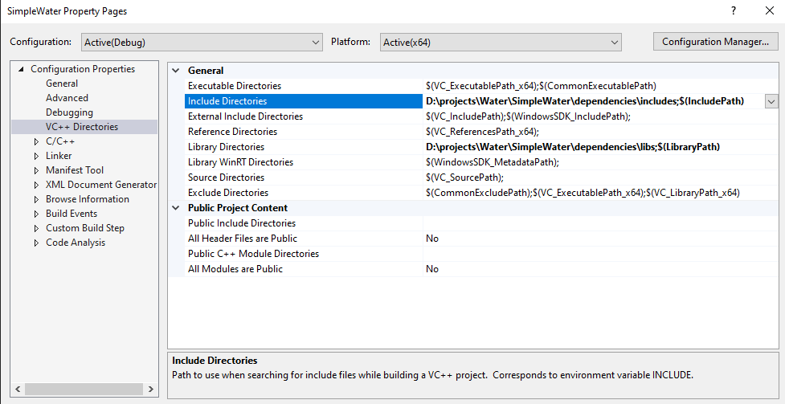
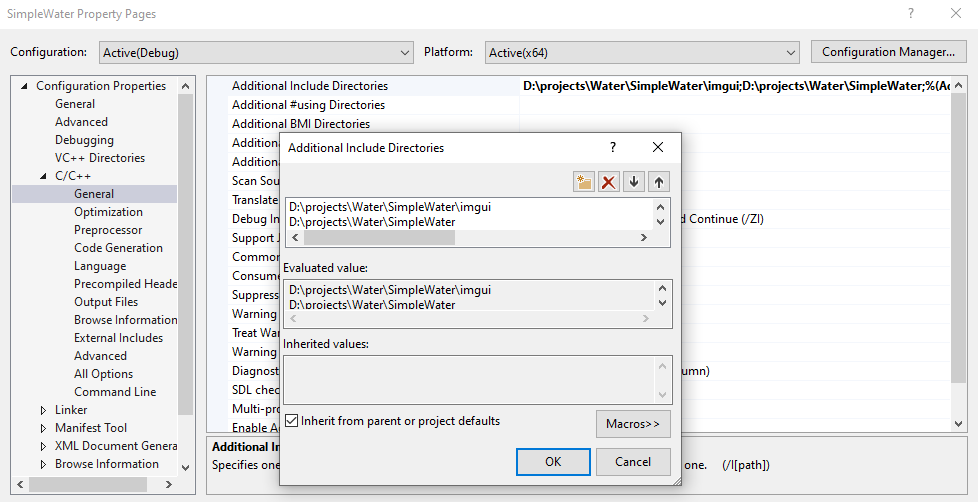
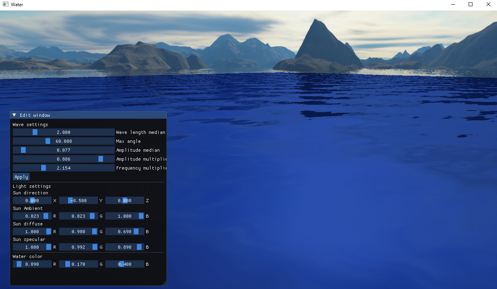

# Sum of sines water simulation
A simple sum of sines water simulation demo made in c++ using OpenGL and GLFW
## Setting up project
Requirements:
- [Microsoft visual studio](https://visualstudio.microsoft.com/)

1. Clone the repository, or download it as a zip archive
2. Adjust location of dependencies in Visual Studio
    - Go to Project -> Properties -> VC++ Directories -> Include directories -> edit, Navigate to the project location -> dependencies -> Includes, and add the include folder
    - Go to Project -> Properties -> VC++ Directories -> Library directories -> edit, Navigate to the project location -> dependencies -> libs, and add the libs folder
    
    - Go to C/C++ -> General -> Additional include directories -> edit, Navigate to project location and add the project folder, and imgui folder
    
3. You should be able to run the program without any errors

## Using and configuring the scene
You can move around the scene using the WASD keys, move up with SPACE and descend using the LEFT SHIFT key.

By pressing G you can bring up the edit window where you can configure the parameters of the scene. By pressing G again you can hide the edit window and can look around again.

